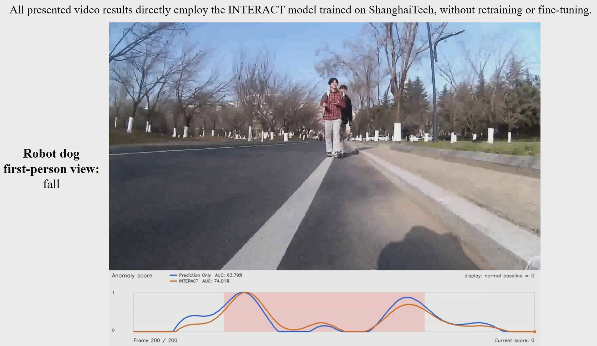
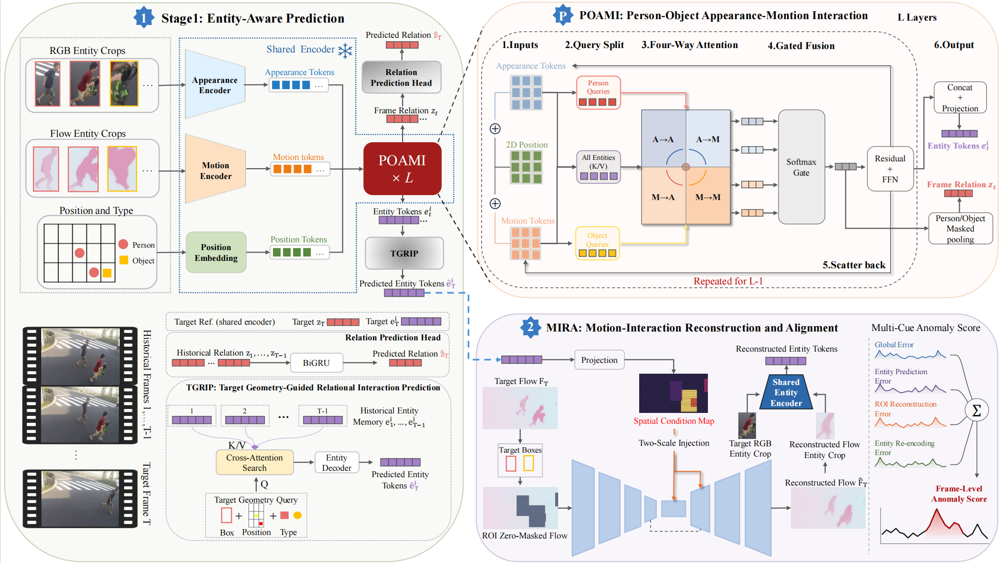

# ✨ 𝙄𝙉𝙏𝙀𝙍𝘼𝘾𝙏 ✨

### Beyond Isolated Entities: Relation-Aware Multi-Entity Modeling for Unsupervised Video Anomaly Detection

 

 

**Interaction-Centric Network for Temporal Entity-Relation Analysis and Consistency Testing.**

 

🚧 **Code · Pretrained Models — Coming Soon**

 

---

## 🌟 Overview

**INTERACT** detects abnormal interactions among people and objects, including cases where each entity appears normal individually but their spatial or motion relationship is unusual.

It jointly models entity appearance, motion, geometry, and temporal relations, then combines interaction prediction with motion reconstruction and semantic consistency checking.

### 👁️ Perceive &nbsp; → &nbsp; 🔗 Relate &nbsp; → &nbsp; 🔮 Predict &nbsp; → &nbsp; ✅ Verify

 

---

## 🎬 Demo Video

<b>Video.</b> Click the thumbnail to view the demo video of INTERACT.

 

---

## 🧩 Framework

  

  <b>Figure 2.</b> Overall framework of INTERACT. <i>[TODO: add the framework figure]</i>

 

- **POAMI**: Person-Object Appearance-Motion Interaction representation.
- **TGRIP**: Target Geometry-Guided Relational Interaction Prediction.
- **MIRA**: Motion-Interaction Reconstruction and Alignment.

 

---

### 📦 Release Status

`💻 Code — Coming Soon` &nbsp;&nbsp; · &nbsp;&nbsp;
`🧠 Pretrained Models — Coming Soon`

 

---

## 📦 Release Status

- [ ] 💻 Source Code
- [ ] 🧠 Pretrained Models
- [ ] 📄 Paper / Supplementary Material
